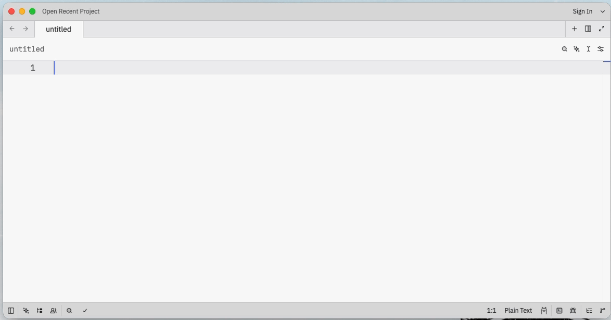
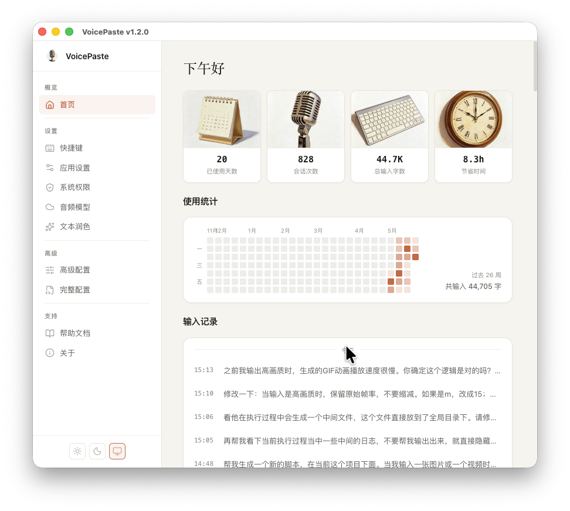
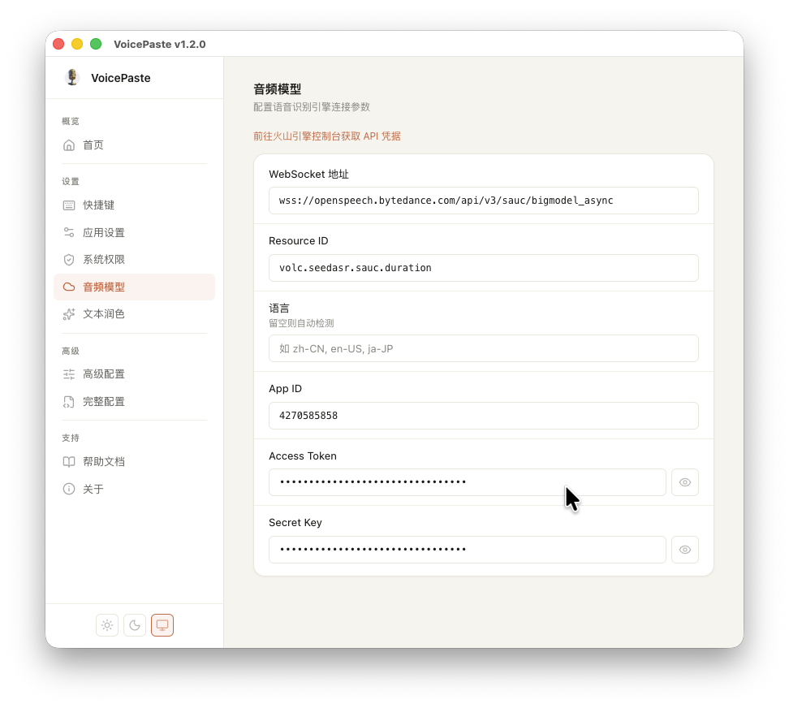
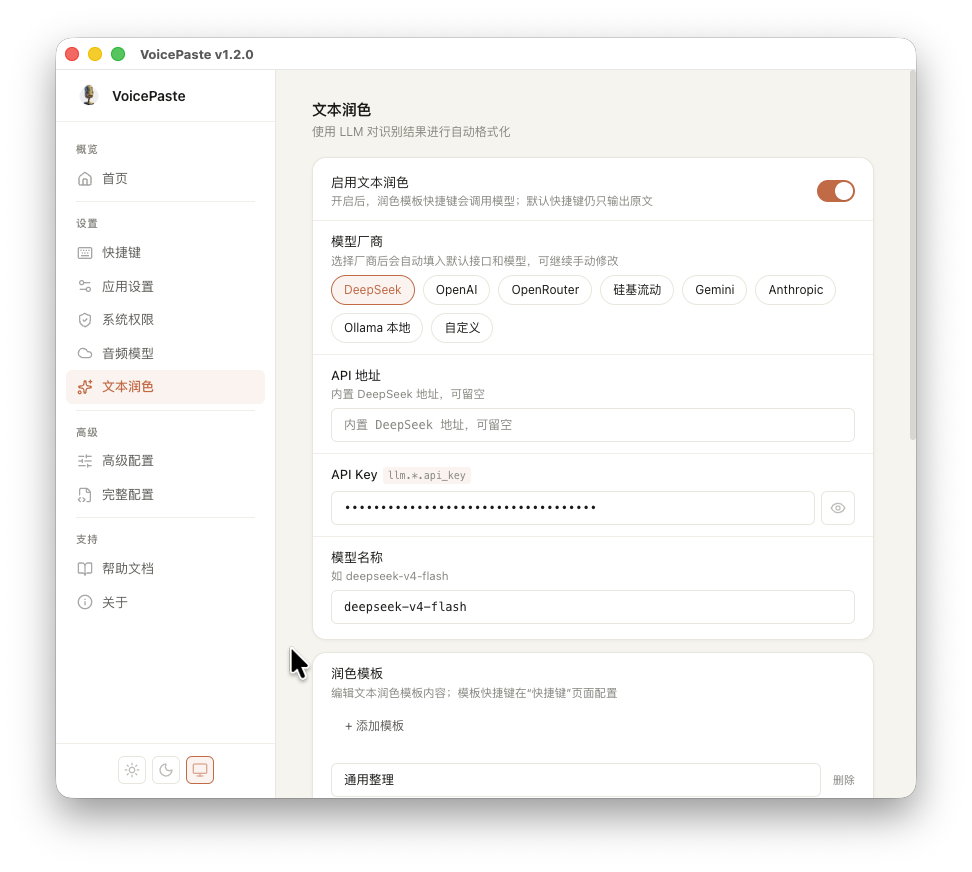

<div align="center">



**[中文](README.zh.md)** | **[English](README.md)**

# VoicePaste

macOS & Windows 语音输入工具 — 通过快捷键触发语音输入并自动粘贴。

[](https://github.com/xuzhiqiang0038/voicepaste/releases/latest)

</div>

## 功能特性

- **全局快捷键** — 默认采用 `config.yaml.example` 中的 `Control+Space`，并支持录制自定义组合键
- **快捷键模式** — 支持 `toggle`（按一次开始、再按一次结束）和 `hold`（按住说话、松开结束）两种触发方式
- **实时语音识别** — 使用字节跳动豆包大模型 ASR，流式返回识别结果
- **自动粘贴** — 识别完成后自动将文本粘贴到当前输入位置
- **浮动窗口** — 透明悬浮窗实时显示识别进度
- **剪贴板控制** — 可选择在粘贴后保留识别结果到剪贴板，便于手动再次粘贴
- **文本清理** — 可自动删除结果末尾的句号 `。` / `.`
- **开机启动** — 可在设置页控制登录系统后自动启动
- **热词支持** — 可自定义热词提升专业术语识别准确率
- **跨平台支持** — 支持 macOS 与 Windows
- **主题切换** — 支持浅色 / 深色 / 跟随系统主题偏好
- **文本润色** — 支持 8 家 LLM 厂商对 ASR 结果进行后处理，可创建多套润色模板并绑定独立快捷键
- **录音反馈** — 实时音频波形动画 + 开始音（录音就绪）与结束音（识别成功）提示
- **苹果签名** — macOS 安装包经过 Apple Developer 签名与公证，安装时不会触发安全警告

## 配置页面




---

## API 获取
- 登录[火山引擎控制台](https://console.volcengine.com/speech/app)，创建一个应用，选择"豆包流式语音识别模型2.0 小时版"


- 进入对应模型，选择创建的 app，并开通模型包，下方可以看到 APP ID，	Access Token，Secret Key


- 填入配置页面填入凭证，点击保存即可



- （可选）在「文本润色」中启用 LLM 并选择厂商，填入 API Key 即可使用



## 配置

编辑项目根目录下的 `config.yaml`，填入你的凭证：

| 配置项 | 说明 |
|--------|------|
| `app.hotkey` | 全局快捷键，默认模板值为 `Control+Space` |
| `app.hotkey_mode` | 快捷键触发模式：`toggle` 或 `hold` |
| `app.remove_trailing_period` | 自动删除最终文本末尾的 `。` / `.` |
| `app.keep_clipboard` | 粘贴后保留识别结果在剪贴板 |
| `app.theme` | 主题偏好：`dark` / `light` / `system` |
| `connection.app_id` | 火山引擎 App ID |
| `connection.access_token` | 火山引擎 Access Token |
| `connection.secret_key` | 火山引擎 Secret Key |
| `connection.resource_id` | ASR 资源 ID |
| `request.context_hotwords` | 自定义热词列表 |
| `llm.enabled` | 启用 LLM 文本润色 |
| `llm.provider` | LLM 厂商：deepseek / openai / anthropic / gemini / openrouter / siliconflow / ollama / openai_compatible |
| `llm.<provider>.url` | 该厂商的 API 地址（内置厂商可留空） |
| `llm.<provider>.api_key` | 该厂商的 API Key |
| `llm.<provider>.model` | 该厂商的模型名称 |

凭证申请请参考 [字节跳动火山引擎语音服务](https://www.volcengine.com/product/voice-service)。

说明：打包产物默认会使用 `config.yaml.example` 作为模板配置，因此实际默认热键应以 `Control+Space` 为准；代码中的 `F13` 只是 `app.hotkey` 缺失时的兜底值。

## FAQ

### macOS 上无法使用？

VoicePaste 需要 **麦克风权限** 和 **辅助功能权限** 才能正常工作。

**麦克风权限**

1. 配置页面 → 系统权限 → 点击「请求权限」
2. 系统设置 → 隐私与安全 → 麦克风，确保 VoicePaste 已被授权
3. 若之前拒绝过，可通过终端重置权限后重新授权：
```bash
tccutil reset Microphone com.xuzhiqiang0038.voicepaste
```

**辅助功能权限**

1. 系统设置 → 隐私与安全 → 辅助功能，确保 VoicePaste 已被授权
2. 若删除后重新安装，需重新添加

### 二遍识别开启后，热词在流式识别中正确但最终结果错误？

二遍识别（non-stream）模式下，官方当前不支持热词库和注入热词，仅支持替换库。建议在[火山引擎控制台](https://console.volcengine.com/speech/correctword)创建替换库，并在配置中将 `boosting_table_id` 替换为 `correct_table_id`。

## 文档

- [开发说明](docs/development.zh.md)
- [更新说明](CHANGELOG.zh.md)

## 致谢

本项目由 xuzhiqiang0038 独立维护，基于 that-yolanda 的原始 VoicePaste 项目继续演进。

## License

[MIT](LICENSE)
